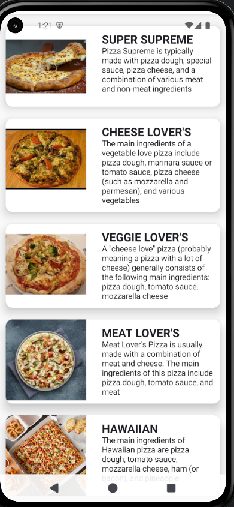
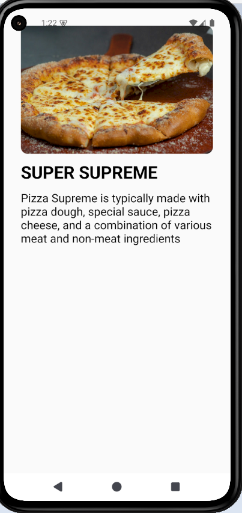

# PizzaMenuApp
:pizza: اپلیکیشن منوی پیتزا - با Jetpack Compose

این اپلیکیشن با استفاده از Jetpack Compose توسعه داده شده و یک نمونه ساده از نمایش لیستی از پیتزاها به همراه قابلیت مشاهده جزئیات هر پیتزا است.

---

## :sparkles: امکانات

- رابط کاربری مدرن با Jetpack Compose
- نمایش لیست پیتزاها با تصویر، نام و توضیحات
- ناوبری بین صفحات با استفاده از Navigation Compose
- استفاده از data class برای مدیریت داده‌ها
- طراحی تمیز با Card و LazyColumn

---

## 🖼 اسکرین‌شات‌ها

### :clipboard: صفحه لیست پیتزاها


### :page_facing_up: صفحه جزئیات پیتزا


---

## 🛠 تکنولوژی‌های استفاده شده

- Kotlin
- Jetpack Compose
- Navigation Compose
- Material Design 3
- Android Studio Giraffe/ Hedgehog یا بالاتر

---

## :rocket: اجرای پروژه

1. پروژه را کلون یا دانلود کنید:
   ```bash
   git clone https://github.com/نام_کاربری_شما/pizza-menu.git
2- پروژه را با Android Studio باز و اجرا نمایید.

## ساختار پروژه ├── MainActivity.kt
├── PizzaMenu.kt
├── DetailScreen.kt
├── ColumnItemUi.kt
├── DataModel.kt
├── README.md
└── screenshots/

## توسعه دهنده:

علیرضا حلوایی فرد
GitHub: @android24h
E-mail: ahf.programmer@gmail.com
Gitd
